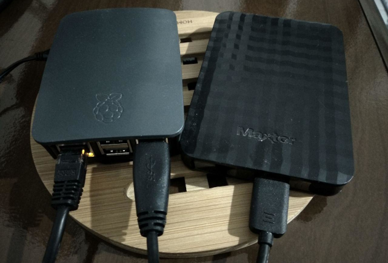

# Raspiberry + Tor + NextCloud

Tutorial para criação de repositório de documentos (textos, imagens, videos etc) seguro, utilizando Nextcloud com criptografia no lado do servidor e acessível pela rede Tor.

## Materiais utilizados:

- Raspberry Pi 3 B+ (outros Raspberries devem funcionar)
- HD Externo (500 MB ou maior recomendado)

## Passos a serem realizados:

1) Instalar o Raspbian Stretch

Siga: https://www.raspberrypi.org/downloads/raspbian/

2) Instalar o HD Externo

Com o Raspbian instalado, assumindo que apenas o HD Externo está conectado ao Raspberry e que este está em `/dev/sda`, siga os comandos:

```
sudo fdisk /dev/sda 
# Press 'd'
# Press 'w'
```

Crie uma partição primária.
```
sudo fdisk /dev/sda
# Press 'n'
# Press 'p'
# Press '1'
# Press 'enter'
# Press 'enter'
# Press 'w'
```

Formate a partição com o sistema de arquivos ext4.
```
sudo mkfs.ext4 /dev/sda1
```

Crie uma pasta para montar.
```
sudo mkdir /mnt/hd
```

Localize o UUID do HD externo.
```
UUID="$(sudo blkid -s UUID -o value /dev/sda1)"
```

Adicione a partição para montagem no fstab.
```
echo "UUID=$UUID /mnt/hd ext4 defaults,nofail 0" | sudo tee -a /etc/fstab
```

Teste o fstab.
```
sudo mount -a
```

Verifique se o HD foi montado.
```
df -h
```
/dev/sda1 deverá aparecer montado em /mnt/hd

3) Instale o Snapd e o Tor

```
sudo apt install snapd tor
```

4) Instale o Nextcloud via Snapd

```
sudo snap install nextcloud
```

5) Habilitando o Hidden Services do Tor

Siga: https://mroystonward.github.io/self-hosting-with-raspberry-pi-and-tor/#installing-tor

Na configuração do Hidden Service, use `HiddenServicePort 80 127.0.0.1:80`, ou seja aponte para porta 80 e não para a 7658, como no tutorial do link.

Reinicie o Tor (`sudo service restart tor`) e verifique seu endereço .onion, com o qual acessará seu Nextcloud, com `sudo cat /var/lib/tor/hidden_service/hostname`. Guarde esse endereço para que ele seja adicionado aos "trusted domains".

6) Adicionando o .onion aos "trusted domains"

Acesse as configurações do Nextcloud com `sudo nano /var/snap/nextcloud/current/nextcloud/config/config.php` e na parte do trusted_domains adicione o endereço .onion, de modo a ficar semelhante ao exemplo abaixo:

```
'trusted_domains' => 
  array (
    0 => '192.168.1.3',
    1 => 'xxxxxxxxxxxxxxxxxxxxxxxxxxxxxx.onion',
  ),
```
Reinicie com `sudo snap restart nextcloud`.

7) Acesse seu Nextcloud via Tor pela primeira vez

Teste o acesso usando o endereço .onion do passo "5" via navegador Tor. O primeiro acesso define qualquer login e senha inseridos como sendo os dados do administrador.

8) Habilite a criptografia no lado do servidor

Todos os documentos armazenados serão criptografados para evitar acessos diretos ao conteúdo armazenados no HD (ou seja, se houver acesso físico e tentativa de acesso aos documentos por outra forma que não via o Nextcloud).

Siga https://docs.nextcloud.com/server/15/admin_manual/configuration_files/encryption_configuration.html#before-enabling-encryption

## Referências

https://help.nextcloud.com/t/running-nextcloud-as-a-hidden-service-tor/25488/10

https://mroystonward.github.io/self-hosting-with-raspberry-pi-and-tor/#setting-up-a-hidden-service

https://docs.nextcloud.com/server/15/admin_manual/configuration_files/encryption_configuration.html#before-enabling-encryption

https://docs.nextcloud.com/server/15/admin_manual/installation/installation_wizard.html#trusted-domains
